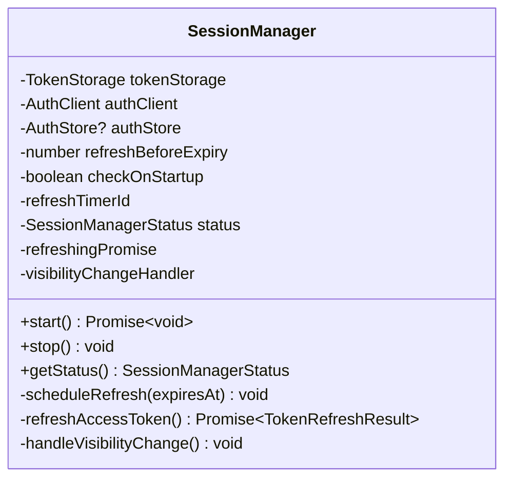

# Issue #145 开发蓝图：SessionManager 增强文档

**创建日期**: 2026-02-28
**架构师**: Claude (Opus 4.6)
**状态**: 设计阶段
**目标**: 为 SessionManager 添加集成测试、JSDoc 文档和架构文档

---

## 一、需求分析

### 1.1 背景
SessionManager 是一个会话管理类，负责 Token 的自动刷新、页面可见性处理等功能。当前代码已实现核心功能，但缺少：
- 集成测试（端到端场景测试）
- 完整的 JSDoc 文档
- 架构设计文档

### 1.2 核心依赖
```typescript
- TokenStorage  // Token 存储接口
- AuthClient    // 认证 API 客户端
- AuthStore     // 认证状态 Store（可选）
- CookieManager // Cookie 管理（AuthClient 内部使用）
```

### 1.3 关键功能点
1. **Token 自动刷新**: 根据 JWT exp 字段计算刷新时机
2. **请求去重**: 多个并发刷新请求合并为一个
3. **页面可见性处理**: 页面恢复显示时主动检查 Token
4. **错误处理**: 401 错误自动登出，网络错误仅停止定时器

---

## 二、集成测试场景设计

### 2.1 测试文件结构
```
frontend/src/lib/auth/__tests__/
├── session-manager.test.ts          # 现有单元测试（约 1500 行）
└── session-manager.integration.test.ts  # 新增：集成测试
```

### 2.2 端到端测试场景清单

#### 场景 1: 完整的会话生命周期
**测试名称**: `完整的会话生命周期：启动 -> 多次刷新 -> 停止`

**前置条件**:
- TokenStorage 存在有效 Token（1 小时后过期）
- AuthClient.refreshToken() 模拟成功响应

**测试步骤**:
1. 创建 SessionManager 实例
2. 调用 `start()` 启动
3. 验证状态为 `RUNNING`
4. 快进时间到 55 分钟后
5. 验证 `refreshToken()` 被调用
6. 验证新 Token 被保存到 TokenStorage
7. 验证 AuthStore.updateAccessToken() 被调用
8. 验证 Cookie 被更新（通过 CookieManager.setAuthToken）
9. 快进另一个 55 分钟
10. 验证第二次刷新成功
11. 调用 `stop()`
12. 验证定时器被清除，状态为 `STOPPED`

**预期断言**:
- `mockAuthClient.refreshToken` 被调用 2 次
- `mockTokenStorage.setTokens` 被调用 2 次
- `mockAuthStore.updateAccessToken` 被调用 2 次
- 最终无活动定时器

---

#### 场景 2: Token 刷新失败后的自动登出
**测试名称**: `401 错误触发自动登出流程`

**前置条件**:
- TokenStorage 存在即将过期的 Token
- AuthClient.refreshToken() 模拟 401 错误

**测试步骤**:
1. 启动 SessionManager
2. 快进时间触发刷新
3. 验证 `refreshToken()` 抛出 401 错误
4. 验证 `authClient.logout({ silent: true })` 被调用
5. 验证 TokenStorage 被清除
6. 验证 AuthStore 被清除
7. 验证 Cookie 被清除
8. 验证定时器被停止
9. 验证状态为 `STOPPED`

**预期断言**:
- `mockAuthClient.logout` 被调用 1 次，参数为 `{ silent: true }`
- `mockTokenStorage.clearTokens` 被调用
- `mockAuthStore.clearAuth` 被调用
- 无活动定时器

---

#### 场景 3: 页面可见性切换 + Token 即将过期
**测试名称**: `页面隐藏后恢复显示时触发刷新`

**前置条件**:
- Token 有效期充足（10 分钟后过期）
- SessionManager 已启动

**测试步骤**:
1. 启动 SessionManager
2. 修改 `document.visibilityState` 为 `'hidden'`
3. 触发 `visibilitychange` 事件
4. 验证刷新**未被**触发
5. 快进时间使 Token 剩余 4 分钟
6. 修改 `document.visibilityState` 为 `'visible'`
7. 触发 `visibilitychange` 事件
8. 验证 `shouldRefreshToken()` 返回 true
9. 验证 `refreshToken()` 被调用
10. 验证刷新成功

**预期断言**:
- 页面隐藏时不触发刷新
- 页面显示 + Token 即将过期时触发刷新
- 去重机制生效（只发起一个请求）

---

#### 场景 4: 并发刷新请求的去重
**测试名称**: `多个组件同时触发刷新时的去重机制`

**前置条件**:
- Token 即将过期
- 模拟网络延迟（100ms）

**测试步骤**:
1. 启动 SessionManager
2. 快进时间触发定时器刷新
3. 在刷新进行中时（50ms 后），手动触发页面可见性事件
4. 等待所有异步操作完成
5. 验证 `refreshToken()` 只被调用 **1 次**
6. 验证所有调用者收到相同的响应

**预期断言**:
- `mockAuthClient.refreshToken` 被调用 1 次
- 去重 Promise 机制工作正常

---

#### 场景 5: checkOnStartup 选项验证
**测试名称**: `启动时立即检查并刷新即将过期的 Token`

**前置条件**:
- Token 剩余有效期 < `refreshBeforeExpiry`（5 分钟）
- `checkOnStartup: true`

**测试步骤**:
1. 创建剩余 4 分钟的 Token
2. 创建 SessionManager，设置 `checkOnStartup: true`
3. 调用 `start()`
4. 验证 `refreshToken()` 被**立即**调用（不等定时器）
5. 验证刷新成功
6. 验证事件监听器被注册

**预期断言**:
- `refreshToken()` 在 `start()` 返回前被调用
- 事件监听器正确注册
- 无定时器竞争条件

---

#### 场景 6: 网络错误重试与恢复（扩展）
**测试名称**: `网络错误后用户手动登录恢复会话`

**前置条件**:
- Token 即将过期
- AuthClient.refreshToken() 模拟网络错误

**测试步骤**:
1. 启动 SessionManager
2. 快进时间触发刷新
3. 模拟网络错误（非 401）
4. 验证定时器停止，状态为 `STOPPED`
5. 验证**未**调用 `logout()`
6. 模拟用户重新登录（外部调用 AuthStore.setAuthUser）
7. 验证可以重新启动 SessionManager
8. 验证新会话正常工作

**预期断言**:
- 网络错误不触发登出
- SessionManager 可以被重新启动

---

### 2.3 Mock 策略

#### TokenStorage Mock
```typescript
const createMockTokenStorage = (): TokenStorage => ({
  setTokens: jest.fn(),
  getTokens: jest.fn(),
  getAccessToken: jest.fn(),
  getRefreshToken: jest.fn(),
  isTokenExpired: jest.fn(),
  clearTokens: jest.fn(),
  hasValidTokens: jest.fn(),
  updateAccessToken: jest.fn(),
});
```

#### AuthClient Mock
```typescript
const createMockAuthClient = (): AuthClient => ({
  refreshToken: jest.fn(),
  logout: jest.fn(),
} as unknown as AuthClient);
```

#### AuthStore Mock
```typescript
const createMockAuthStore = (): AuthStore => ({
  status: 'unauthenticated',
  user: null,
  accessToken: null,
  refreshToken: null,
  tokenExpiresAt: null,
  error: null,
  isAuthenticating: false,
  setLoading: jest.fn(),
  setAuthUser: jest.fn(),
  updateAccessToken: jest.fn(),
  clearAuth: jest.fn(),
  setError: jest.fn(),
  clearError: jest.fn(),
  toJSON: jest.fn(() => ({})),
  fromJSON: jest.fn(),
  reset: jest.fn(),
});
```

#### JWT Mock 辅助函数
```typescript
// 使用现有的 createMockJWT 函数
// 确保时间一致性：使用 MOCK_JWT_BASE_TIME 作为基准
```

### 2.4 定时器处理
```typescript
beforeEach(() => {
  jest.useFakeTimers();
  jest.setSystemTime(new Date(MOCK_JWT_BASE_TIME * 1000));
});

afterEach(() => {
  jest.clearAllTimers();
  jest.useRealTimers();
  jest.setSystemTime();
});

// 使用异步定时器方法
await jest.runOnlyPendingTimersAsync();
await jest.runAllTimersAsync();
jest.advanceTimersByTimeAsync(1000);
```

### 2.5 页面可见性 Mock
```typescript
// 使用 Object.defineProperty 模拟
Object.defineProperty(document, 'visibilityState', {
  writable: true,
  value: 'visible',
});

Object.defineProperty(document, 'hidden', {
  writable: true,
  value: false,
});

// 触发事件
const event = new Event('visibilitychange');
document.dispatchEvent(event);
```

---

## 三、JSDoc 文档规范

### 3.1 文档注释模板

#### 类级别注释
```typescript
/**
 * Session Manager - Token 自动刷新管理器
 *
 * 负责管理 Token 的自动刷新生命周期，确保用户会话持续有效。
 *
 * @remarks
 * SessionManager 通过解析 JWT Token 的 exp 字段计算刷新时机，
 * 在 Token 过期前 `refreshBeforeExpiry` 毫秒触发刷新。
 *
 * 核心功能：
 * - 自动刷新：基于 setTimeout 调度刷新任务
 * - 请求去重：多个并发刷新请求合并为一个
 * - 页面可见性：页面恢复显示时主动检查 Token
 * - 错误处理：401 错误自动登出，网络错误仅停止定时器
 *
 * @example
 * ```ts
 * const sessionManager = new SessionManager({
 *   tokenStorage: createTokenStorage(),
 *   authClient: authClient,
 *   authStore: authStore,
 * });
 *
 * await sessionManager.start();
 * sessionManager.stop();
 * ```
 *
 * @see {@link https://jwt.io/ | JWT 规范}
 * @see AuthClient
 * @see TokenStorage
 */
export class SessionManager {
  // ...
}
```

#### 公开方法注释
```typescript
/**
 * 启动会话管理器
 *
 * 启动自动刷新定时器，并注册页面可见性事件监听。
 *
 * @remarks
 * - 如果 Token 不存在或无法解析，保持 IDLE 状态
 * - 如果 `checkOnStartup` 为 true 且 Token 即将过期，立即刷新
 * - 多次调用具有幂等性（先停止再启动）
 *
 * @throws 此方法本身不抛出异常，但内部的 `refreshAccessToken` 可能抛出
 *
 * @example
 * ```ts
 * await sessionManager.start();
 * console.log(sessionManager.getStatus()); // 'running'
 * ```
 */
async start(): Promise<void> {
  // ...
}
```

#### 私有方法注释
```typescript
/**
 * 调度下一次 Token 刷新
 *
 * 计算刷新时机并设置 setTimeout 定时器。
 *
 * @param expiresAt - Token 过期时间戳（毫秒）
 *
 * @remarks
 * - 如果 Token 已过期，立即触发刷新（延迟为 0）
 * - 刷新时机 = `expiresAt - refreshBeforeExpiry`
 * - 会先清除现有定时器，再设置新定时器
 */
private scheduleRefresh(expiresAt: number): void {
  // ...
}
```

#### 参数注释
```typescript
/**
 * @param options - SessionManager 配置选项
 * @param options.tokenStorage - Token 存储实例（必需）
 * @param options.authClient - 认证客户端实例（必需）
 * @param options.authStore - 认证 Store 实例（可选）
 * @param options.refreshBeforeExpiry - Token 刷新提前量（毫秒，默认 5 分钟）
 * @param options.checkOnStartup - 是否在启动时立即检查（默认 false）
 */
constructor(options: SessionManagerOptions) {
  // ...
}
```

### 3.2 需要添加/完善的 JSDoc 注释

#### 已有但需完善的方法
- `stop()`: 添加幂等性说明
- `getStatus()`: 添加返回值示例
- `handleVisibilityChange()`: 添加事件处理逻辑说明

#### 需要添加的私有方法注释
- `setupVisibilityListener()`: SSR 安全检查说明
- `removeVisibilityListener()`: 幂等性说明

#### 常量注释
```typescript
/**
 * 默认刷新提前时间（5 分钟）
 *
 * 在 Token 过期前 5 分钟触发刷新
 * 避免在请求处理期间 Token 过期
 */
const DEFAULT_REFRESH_BEFORE_EXPIRY = 5 * 60 * 1000;

/**
 * 最小刷新间隔（30 秒）
 *
 * 避免过于频繁的刷新请求
 * 防止服务器负载过高
 */
const MIN_REFRESH_INTERVAL = 30 * 1000;
```

### 3.3 类型注释
```typescript
/**
 * SessionManager 配置选项
 */
export interface SessionManagerOptions {
  /**
   * Token 存储实例
   *
   * 用于读取和保存 Token
   */
  tokenStorage: TokenStorage;

  /**
   * 认证客户端实例
   *
   * 用于执行 Token 刷新和登出操作
   */
  authClient: AuthClient;

  /**
   * 认证 Store 实例（可选）
   *
   * 用于更新认证状态
   * 如果不提供，刷新后仅更新 TokenStorage
   */
  authStore?: AuthStore;

  /**
   * Token 刷新提前量（毫秒）
   *
   * @defaultValue `5 * 60 * 1000`（5 分钟）
   */
  refreshBeforeExpiry?: number;

  /**
   * 是否在启动时立即检查并刷新
   *
   * @defaultValue `false`
   */
  checkOnStartup?: boolean;
}

/**
 * 会话管理器状态
 *
 * @remarks
 * - `IDLE`: 未启动或无有效 Token
 * - `RUNNING`: 定时器已激活，正在监控 Token
 * - `STOPPED`: 已停止，定时器已清除
 */
export enum SessionManagerStatus {
  /** 未启动 */
  IDLE = 'idle',
  /** 运行中（定时器已激活） */
  RUNNING = 'running',
  /** 已停止 */
  STOPPED = 'stopped',
}
```

---

## 四、架构文档大纲

### 4.1 文档位置
```
docs/
└── architecture/
    └── session-manager.md
```

### 4.2 文档结构

```markdown
# SessionManager 架构设计文档

## 1. 概述

### 1.1 职责
SessionManager 是一个会话管理类，负责：
- Token 自动刷新
- 页面可见性处理
- 刷新失败后的错误处理

### 1.2 设计原则
- 单一职责：仅负责会话生命周期管理
- 依赖注入：所有外部依赖通过构造函数注入
- 简洁直观：方法命名清晰，易于理解

## 2. 核心概念

### 2.1 Token 刷新机制
[描述 JWT 解析、过期时间计算、定时器调度]

### 2.2 请求去重
[描述 refreshingPromise 的去重机制]

### 2.3 页面可见性处理
[描述 visibilitychange 事件监听]

## 3. 类图

[Mermaid 类图]


## 4. 时序图

### 4.1 启动流程
[Mermaid 时序图]

### 4.2 Token 刷新流程
[Mermaid 时序图]

### 4.3 页面可见性处理流程
[Mermaid 时序图]

## 5. 状态机

[描述 IDLE -> RUNNING -> STOPPED 状态转换]

## 6. 错误处理策略

### 6.1 401 错误
[描述自动登出逻辑]

### 6.2 网络错误
[描述停止定时器但不登出的逻辑]

## 7. 依赖关系

### 7.1 直接依赖
- TokenStorage
- AuthClient
- AuthStore（可选）

### 7.2 间接依赖
- CookieManager（通过 AuthClient）
- HttpClient（通过 AuthClient）

## 8. 使用示例

### 8.1 基础使用
```typescript
const sessionManager = new SessionManager({
  tokenStorage: createTokenStorage(),
  authClient: authClient,
  authStore: authStore,
});

await sessionManager.start();
```

### 8.2 自定义配置
```typescript
const sessionManager = new SessionManager({
  tokenStorage: createTokenStorage(),
  authClient: authClient,
  authStore: authStore,
  refreshBeforeExpiry: 10 * 60 * 1000, // 10 分钟
  checkOnStartup: true,
});
```

### 8.3 在 React 组件中使用
```typescript
useEffect(() => {
  sessionManager.start();
  return () => sessionManager.stop();
}, []);
```

## 9. 测试策略

### 9.1 单元测试
[描述现有单元测试覆盖]

### 9.2 集成测试
[描述新增集成测试场景]

## 10. 常见问题

### 10.1 为什么需要请求去重？
[回答]

### 10.2 如何处理 Token 过期？
[回答]

### 10.3 SSR 兼容性如何保证？
[回答]

## 11. 未来改进

- [ ] 支持多标签页同步（BroadcastChannel）
- [ ] 支持刷新重试机制
- [ ] 支持自定义刷新策略
```

---

## 五、技术实现要点

### 5.1 Mock 策略细节

#### 避免无限循环
```typescript
// 错误示例：会导致无限循环
(mockTokenStorage.getTokens as jest.Mock).mockReturnValue(mockTokens);

// 正确示例：使用 mockReturnValueOnce 控制调用次数
(mockTokenStorage.getTokens as jest.Mock)
  .mockReturnValueOnce(mockTokens)    // 第 1 次
  .mockReturnValueOnce(newTokens)     // 第 2 次
  .mockReturnValueOnce(null);         // 第 3 次
```

#### 时间一致性
```typescript
// 使用固定基准时间
const MOCK_JWT_BASE_TIME = 1704067200; // 2024-01-01 00:00:00 UTC

jest.setSystemTime(new Date(MOCK_JWT_BASE_TIME * 1000));

// 创建 JWT 时使用相同基准
const exp = MOCK_JWT_BASE_TIME + expiresIn;
```

### 5.2 定时器控制

#### 关键方法
```typescript
// 快进时间但不执行回调
jest.advanceTimersByTime(1000);

// 执行所有待处理的定时器
await jest.runAllTimersAsync();

// 执行一次待处理的定时器（推荐）
await jest.runOnlyPendingTimersAsync();

// 快进并执行
await jest.advanceTimersByTimeAsync(1000);
```

#### 避免无限循环
```typescript
// 错误：可能导致无限循环
await jest.runAllTimersAsync();

// 正确：限制执行次数
await jest.runOnlyPendingTimersAsync();
```

### 5.3 异步控制

#### 等待异步操作
```typescript
// 触发刷新
jest.advanceTimersByTime(55 * 60 * 1000);

// 等待刷新完成
await jest.runOnlyPendingTimersAsync();

// 验证结果
expect(mockAuthClient.refreshToken).toHaveBeenCalled();
```

#### 测试并发场景
```typescript
let refreshCallCount = 0;
(mockAuthClient.refreshToken as jest.Mock).mockImplementation(async () => {
  refreshCallCount++;
  await new Promise((resolve) => setTimeout(resolve, 50));
  return mockTokenResponse;
});

// 在刷新进行中时触发另一个事件
jest.advanceTimersByTime(50);
document.dispatchEvent(new Event('visibilitychange'));

// 验证去重
await jest.runOnlyPendingTimersAsync();
expect(refreshCallCount).toBe(1);
```

### 5.4 页面可见性 Mock

#### 完整示例
```typescript
describe('页面可见性处理', () => {
  beforeEach(() => {
    // 保存原始值
    this.originalVisibilityState = Object.getOwnPropertyDescriptor(
      document,
      'visibilityState'
    );
  });

  afterEach(() => {
    // 恢复原始值
    if (this.originalVisibilityState) {
      Object.defineProperty(
        document,
        'visibilityState',
        this.originalVisibilityState
      );
    }
  });

  it('应该在页面显示时检查 Token', async () => {
    Object.defineProperty(document, 'visibilityState', {
      writable: true,
      value: 'visible',
    });

    const event = new Event('visibilitychange');
    document.dispatchEvent(event);

    await jest.runOnlyPendingTimersAsync();
    expect(mockAuthClient.refreshToken).toHaveBeenCalled();
  });
});
```

### 5.5 环境变量 Mock

#### SSR 安全检查
```typescript
// SessionManager 中已有 typeof document !== 'undefined' 检查
// 测试时在 jsdom 环境下 document 存在，无需额外 Mock

// 如果需要测试 SSR 场景
describe('SSR 兼容性', () => {
  it('应该在服务端跳过事件监听注册', () => {
    const originalDocument = global.document;
    // @ts-expect-error - 模拟服务端环境
    delete global.document;

    const sessionManager = new SessionManager({...});
    await sessionManager.start();

    // 验证事件监听器未被注册
    global.document = originalDocument;
  });
});
```

---

## 六、验收标准

### 6.1 集成测试验收
- [ ] 所有 6 个端到端场景测试通过
- [ ] 测试覆盖率 > 90%（新增代码）
- [ ] 无测试泄漏（定时器、事件监听器）

### 6.2 JSDoc 文档验收
- [ ] 所有公开方法有完整 JSDoc
- [ ] 所有私有方法有说明性注释
- [ ] 类型注释完整（params, returns, throws, remarks）
- [ ] 使用 `@example` 提供使用示例

### 6.3 架构文档验收
- [ ] 文档包含章节大纲中的所有内容
- [ ] Mermaid 图表正确渲染
- [ ] 代码示例可直接运行
- [ ] 常见问题有实际参考价值

---

## 七、文件清单

### 7.1 新增文件
```
frontend/src/lib/auth/__tests__/session-manager.integration.test.ts
docs/architecture/session-manager.md
```

### 7.2 修改文件
```
frontend/src/lib/auth/session-manager.ts (增强 JSDoc)
```

---

## 八、实施建议

### 8.1 开发顺序
1. **先写集成测试**：遵循 TDD 原则，先写测试再实现
2. **完善 JSDoc**：边写代码边补充文档
3. **编写架构文档**：最后编写架构文档，总结设计

### 8.2 代码审查要点
- [ ] Mock 策略是否合理（避免无限循环）
- [ ] 定时器是否正确清理（无泄漏）
- [ ] 异步操作是否正确等待
- [ ] 边界情况是否覆盖（无 Token、Token 过期等）

---

**文档版本**: 1.0
**最后更新**: 2026-02-28
