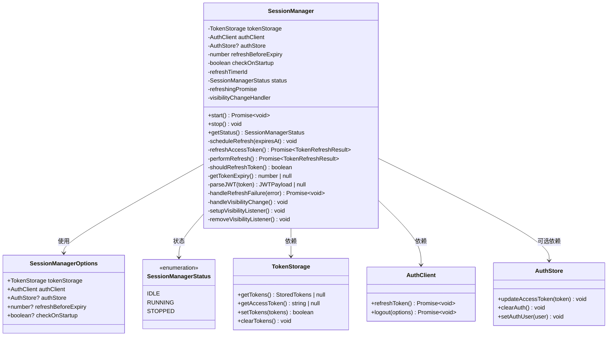
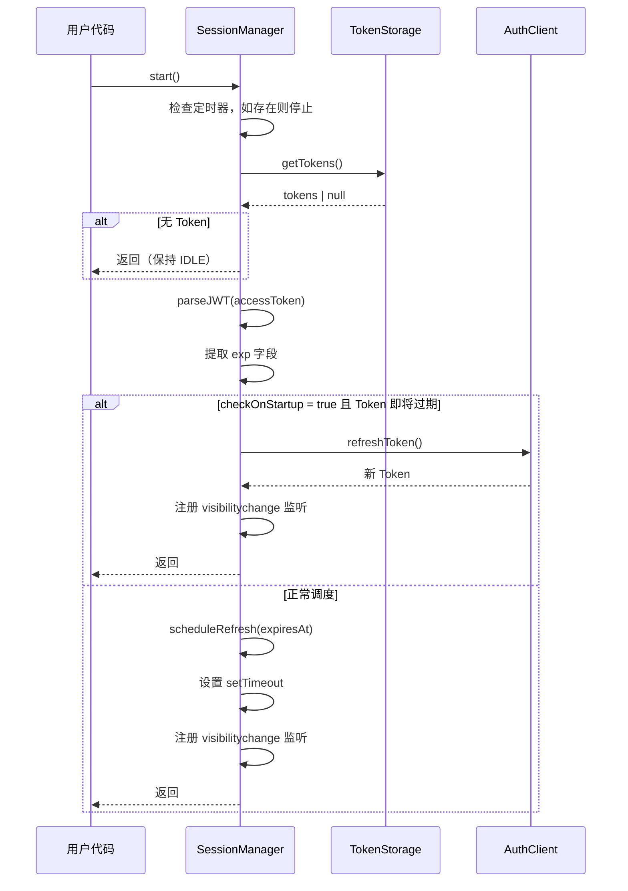
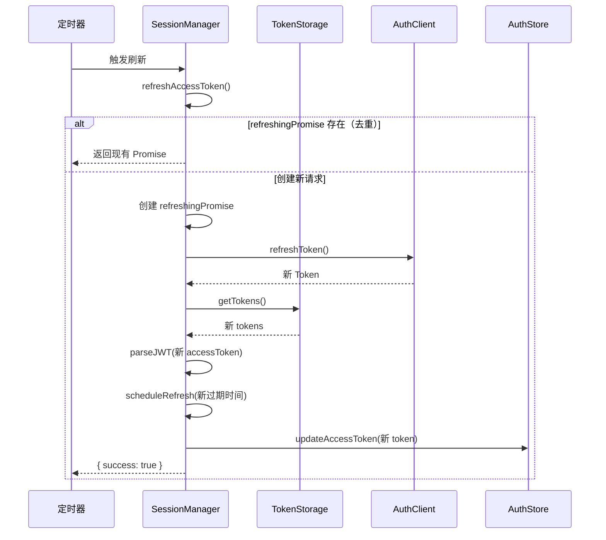
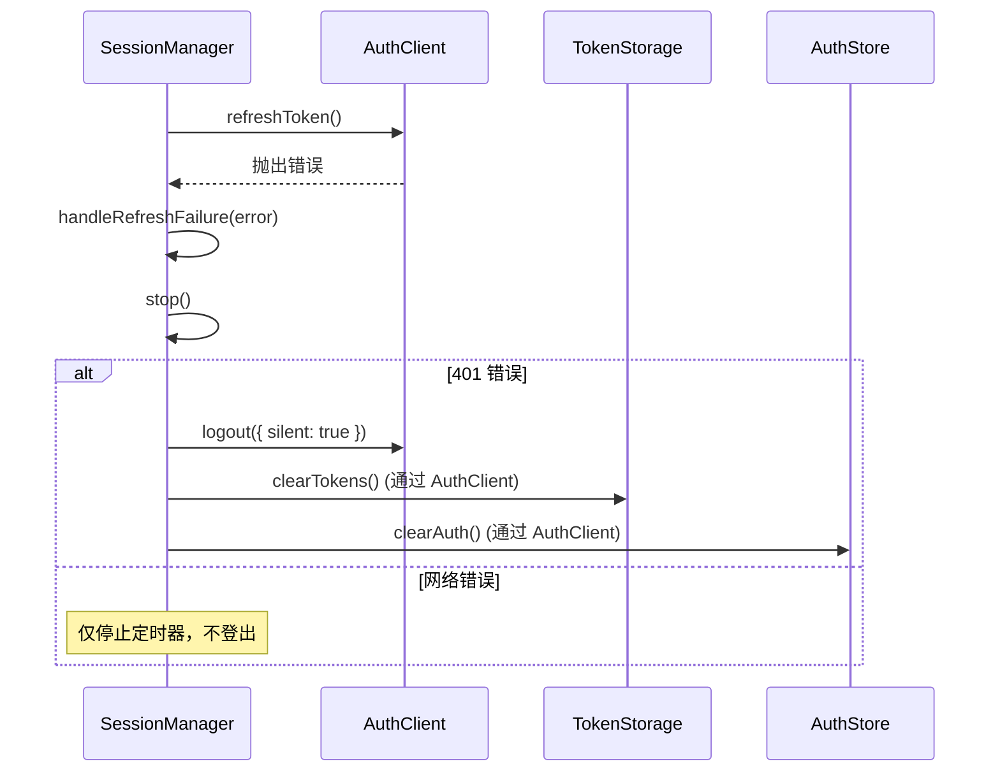
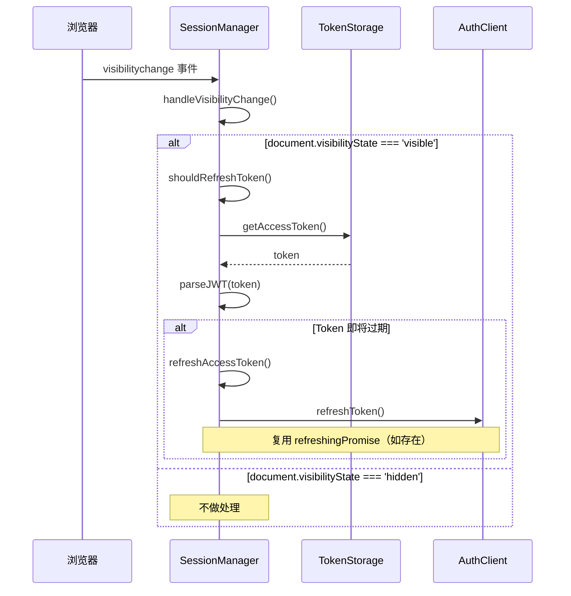
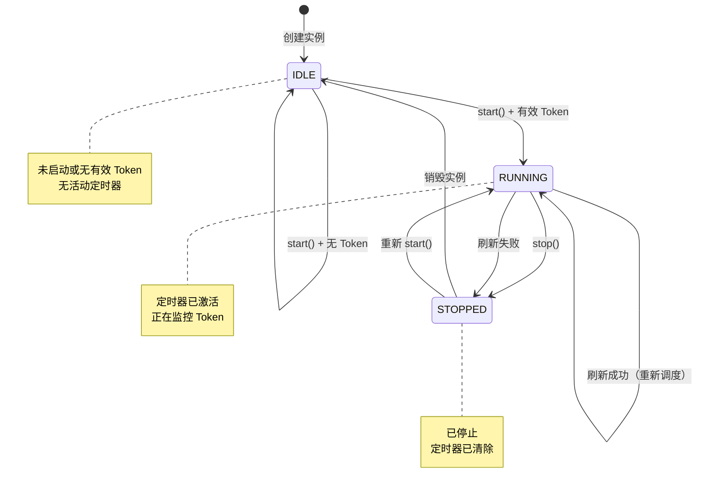

# SessionManager 架构设计文档

**版本**: 1.0
**最后更新**: 2026-02-28
**文件路径**: `frontend/src/lib/auth/session-manager.ts`

---

## 1. 概述

### 1.1 职责

SessionManager 是一个会话管理类，负责：

- **Token 自动刷新**：根据 JWT `exp` 字段计算刷新时机，在 Token 过期前自动刷新
- **页面可见性处理**：监听 `visibilitychange` 事件，页面恢复显示时主动检查 Token
- **刷新失败后的错误处理**：401 错误自动登出，网络错误仅停止定时器
- **请求去重**：多个并发刷新请求合并为一个，避免重复请求

### 1.2 设计原则

- **单一职责**：仅负责会话生命周期管理，不处理用户登录/注册逻辑
- **依赖注入**：所有外部依赖通过构造函数注入，便于测试和替换
- **简洁直观**：方法命名清晰，易于理解和使用
- **幂等性**：`start()` 和 `stop()` 方法可以重复调用

### 1.3 核心依赖

```typescript
import type { TokenStorage } from '@/lib/storage/token-storage';
import type { AuthClient } from '@/lib/api/auth-client';
import type { AuthStore } from '@/store/auth/auth-store-types';
```

| 依赖 | 用途 | 是否必需 |
|------|------|----------|
| `TokenStorage` | 读取和保存 Token | 是 |
| `AuthClient` | 执行刷新和登出操作 | 是 |
| `AuthStore` | 更新认证状态（UI 响应） | 否 |

---

## 2. 核心概念

### 2.1 Token 刷新机制

SessionManager 通过解析 JWT Token 的 `exp`（过期时间）字段来计算刷新时机。

**刷新时机计算**：

```
刷新延迟 = (Token 过期时间) - (当前时间) - (刷新提前量)
```

- 如果 `刷新延迟 <= 0`：立即触发刷新
- 如果 `刷新延迟 > 0`：设置 `setTimeout` 定时器

**默认刷新提前量**：5 分钟（`DEFAULT_REFRESH_BEFORE_EXPIRY = 5 * 60 * 1000`）

**示例**：

| Token 过期时间 | 当前时间 | 刷新提前量 | 实际刷新时机 |
|---------------|---------|-----------|-------------|
| 10:00 | 09:00 | 5 分钟 | 09:55 |
| 10:00 | 09:56 | 5 分钟 | 立即 |

### 2.2 请求去重机制

为防止多个并发调用同时发起刷新请求，SessionManager 使用 `refreshingPromise` 进行去重：

```typescript
private refreshingPromise: Promise<TokenRefreshResult> | null = null;

private async refreshAccessToken(): Promise<TokenRefreshResult> {
  // 如果已有进行中的刷新，复用该 Promise
  if (this.refreshingPromise !== null) {
    return this.refreshingPromise;
  }

  // 创建新的刷新 Promise
  this.refreshingPromise = this.performRefresh();

  try {
    return await this.refreshingPromise;
  } finally {
    // 无论成功失败，清空 Promise 引用
    this.refreshingPromise = null;
  }
}
```

**去重流程**：

1. 检查 `refreshingPromise` 是否存在
2. 如果存在，返回该 Promise（复用进行中的请求）
3. 如果不存在，创建新的刷新 Promise 并保存
4. 等待刷新完成后清空 `refreshingPromise`

**应用场景**：多个组件同时调用 `start()` 或页面可见性事件触发时

### 2.3 页面可见性处理

SessionManager 监听 `visibilitychange` 事件，在页面恢复显示时主动检查 Token：

```typescript
private handleVisibilityChange(): void {
  // 仅在页面显示时检查是否需要刷新
  if (document.visibilityState === 'visible') {
    if (this.shouldRefreshToken()) {
      this.refreshAccessToken();
    }
  }
}
```

**关键行为**：

- 页面隐藏时不暂停定时器（避免页面恢复后 Token 已过期）
- 页面显示时主动检查是否需要立即刷新
- 使用 `typeof document !== 'undefined'` 确保 SSR 兼容性

### 2.4 错误处理策略

| 错误类型 | 处理方式 | 说明 |
|----------|----------|------|
| 401 Unauthorized | 自动登出 | Refresh Token 无效或过期 |
| 网络错误 | 停止定时器 | 临时故障，不登出用户 |
| 其他错误 | 停止定时器 | 默认保守策略 |

---

## 3. 类图



---

## 4. 时序图

### 4.1 启动流程



### 4.2 Token 刷新流程



### 4.3 刷新失败处理流程



### 4.4 页面可见性处理流程



---

## 5. 状态机

SessionManager 有三种状态，状态转换如下：



**状态转换条件**：

| 当前状态 | 触发条件 | 目标状态 |
|----------|----------|----------|
| `IDLE` | `start()` + 有效 Token | `RUNNING` |
| `IDLE` | `start()` + 无 Token | `IDLE` |
| `RUNNING` | Token 刷新成功 | `RUNNING`（重新调度） |
| `RUNNING` | `stop()` | `STOPPED` |
| `RUNNING` | 刷新失败（401 或网络错误） | `STOPPED` |
| `STOPPED` | 重新 `start()` | `RUNNING` |

---

## 6. 错误处理策略

### 6.1 401 Unauthorized 错误

当刷新 Token 返回 401 状态码时，SessionManager 会：

1. 停止定时器（调用 `stop()`）
2. 调用 `AuthClient.logout({ silent: true })` 执行静默登出
3. 清除 TokenStorage 中的 Token
4. 清除 AuthStore 中的认证状态

**代码逻辑**：

```typescript
private async handleRefreshFailure(error: Error): Promise<void> {
  this.stop();

  const isUnauthorized = (error as any).status === 401;

  if (isUnauthorized) {
    try {
      await this.authClient.logout({ silent: true });
    } catch {
      // 忽略 logout 错误
    }
  }

  console.error('Token refresh failed, logging out:', error);
}
```

### 6.2 网络错误

当刷新 Token 因网络问题失败时，SessionManager 会：

1. 停止定时器（调用 `stop()`）
2. **不**调用登出逻辑
3. 用户可以继续使用当前功能
4. Token 实际过期后，API 请求会返回 401，由其他模块处理

### 6.3 其他错误

对于未识别的错误类型，采用保守策略：

1. 停止定时器
2. 不登出用户
3. 记录错误日志

---

## 7. 依赖关系

### 7.1 直接依赖

#### TokenStorage

**文件**: `frontend/src/lib/storage/token-storage.ts`

**SessionManager 使用的方法**：

| 方法 | 用途 |
|------|------|
| `getTokens()` | 获取当前存储的 Token 对象 |
| `getAccessToken()` | 获取访问令牌 |
| `setTokens()` | 保存新刷新的 Token（由 AuthClient 调用） |
| `clearTokens()` | 清除 Token（由 AuthClient 调用） |

#### AuthClient

**文件**: `frontend/src/lib/api/auth-client.ts`

**SessionManager 使用的方法**：

| 方法 | 用途 |
|------|------|
| `refreshToken()` | 刷新访问令牌 |
| `logout({ silent: true })` | 静默登出（401 错误时） |

#### AuthStore（可选）

**文件**: `frontend/src/store/auth/auth-store-types.ts`

**SessionManager 使用的方法**：

| 方法 | 用途 |
|------|------|
| `updateAccessToken()` | 更新 UI 状态中的 Token |
| `clearAuth()` | 清除认证状态（由 AuthClient 调用） |

### 7.2 间接依赖

- **CookieManager**: AuthClient 内部使用，用于设置 HTTP-only Cookie
- **HttpClient**: AuthClient 内部使用，用于发送 API 请求

### 7.3 依赖注入示例

```typescript
const sessionManager = new SessionManager({
  tokenStorage: createTokenStorage(),  // 必需
  authClient: authClient,              // 必需
  authStore: authStore,                // 可选
  refreshBeforeExpiry: 10 * 60 * 1000, // 可选，默认 5 分钟
  checkOnStartup: true,                // 可选，默认 false
});
```

---

## 8. 使用示例

### 8.1 基础使用

```typescript
import { SessionManager } from '@/lib/auth/session-manager';
import { createTokenStorage } from '@/lib/storage/token-storage';
import { authClient } from '@/lib/api/auth-client';
import { authStore } from '@/store/auth/auth-store';

const sessionManager = new SessionManager({
  tokenStorage: createTokenStorage(),
  authClient: authClient,
  authStore: authStore,
});

// 启动自动刷新
await sessionManager.start();
```

### 8.2 自定义配置

```typescript
const sessionManager = new SessionManager({
  tokenStorage: createTokenStorage(),
  authClient: authClient,
  authStore: authStore,
  refreshBeforeExpiry: 10 * 60 * 1000, // 10 分钟
  checkOnStartup: true, // 启动时检查并刷新
});

await sessionManager.start();
```

### 8.3 在 React 组件中使用

```typescript
import { useEffect } from 'react';
import { SessionManager } from '@/lib/auth/session-manager';

function App() {
  useEffect(() => {
    // 组件挂载时启动
    sessionManager.start();

    // 组件卸载时停止
    return () => {
      sessionManager.stop();
    };
  }, []);

  return <div>...</div>;
}
```

### 8.4 检查状态

```typescript
const status = sessionManager.getStatus();
if (status === SessionManagerStatus.RUNNING) {
  console.log('SessionManager 正在运行');
} else if (status === SessionManagerStatus.STOPPED) {
  console.log('SessionManager 已停止');
}
```

---

## 9. 测试策略

### 9.1 单元测试

**文件**: `frontend/src/lib/auth/__tests__/session-manager.test.ts`

**覆盖范围**：

- 构造函数依赖注入
- `start()` 启动定时器
- `start()` 无 Token 时保持 IDLE 状态
- `start()` 多次调用的幂等性
- `stop()` 清除定时器并设置 STOPPED 状态
- `stop()` 多次调用的幂等性
- `getStatus()` 返回当前状态
- `parseJWT()` 解析 JWT Token
- `getTokenExpiry()` 提取过期时间
- `scheduleRefresh()` 计算正确的刷新时机
- `scheduleRefresh()` 边界情况处理（过期时间已过）
- `refreshAccessToken()` 刷新成功后重新调度
- `refreshAccessToken()` 401 错误时自动登出
- `refreshAccessToken()` 网络错误时停止定时器
- 定时器清理验证（使用 `jest.useFakeTimers()`）

### 9.2 集成测试

**文件**: `frontend/src/lib/auth/__tests__/session-manager.integration.test.ts`

**测试场景**：

1. **完整的会话生命周期**：启动 -> 多次刷新 -> 停止
2. **Token 刷新失败后的自动登出**：401 错误触发登出流程
3. **页面可见性切换 + Token 即将过期**：页面隐藏后恢复显示时触发刷新
4. **并发刷新请求的去重**：多个组件同时触发刷新时的去重机制
5. **checkOnStartup 选项验证**：启动时立即检查并刷新即将过期的 Token
6. **网络错误重试与恢复**：网络错误后用户手动登录恢复会话

---

## 10. 常见问题

### 10.1 为什么需要请求去重？

**问题**：多个组件可能同时调用 `start()`，或定时器刷新与页面可见性事件同时触发。

**解决方案**：使用 `refreshingPromise` 缓存进行中的刷新请求，后续调用复用该 Promise。

**好处**：

- 减少 HTTP 请求次数
- 避免服务器负载
- 确保所有调用者获得一致的结果

### 10.2 如何处理 Token 过期？

**问题**：Token 可能在刷新请求处理期间过期。

**解决方案**：在 Token 过期前 5 分钟（可配置）触发刷新。

**刷新时机**：

```
刷新时间 = Token 过期时间 - 刷新提前量（默认 5 分钟）
```

### 10.3 SSR 兼容性如何保证？

**问题**：服务端渲染时 `document` 对象不存在。

**解决方案**：使用 `typeof document !== 'undefined'` 检查。

**代码**：

```typescript
private setupVisibilityListener(): void {
  if (typeof document === 'undefined') return; // SSR 安全检查
  // ...
}
```

### 10.4 为什么页面隐藏时不暂停定时器？

**问题**：是否应该在页面隐藏时暂停刷新？

**决策**：不暂停定时器。

**原因**：

1. 用户可能在多个标签页中使用同一账号
2. 页面隐藏期间 Token 仍会过期
3. 页面恢复时可能需要立即刷新（或已过期）

**替代方案**：页面显示时主动检查是否需要刷新。

### 10.5 网络错误后如何恢复？

**问题**：刷新失败后，SessionManager 已停止，如何恢复？

**解决方案**：用户重新登录后，可以重新启动 SessionManager。

**代码**：

```typescript
// 网络错误后 SessionManager 已停止
// 用户重新登录
await authClient.login({ username, password });

// 重新启动 SessionManager
await sessionManager.start();
```

---

## 11. 未来改进

- [ ] **多标签页同步**：使用 `BroadcastChannel` 在多个标签页间同步刷新状态
- [ ] **刷新重试机制**：网络错误时自动重试（指数退避）
- [ ] **自定义刷新策略**：支持根据 Token 剩余有效期动态调整刷新时机
- [ ] **刷新事件通知**：提供事件订阅机制，通知外部 Token 刷新状态
- [ ] **心跳检测**：定期检查 Token 有效性，主动发现失效情况

---

## 12. 参考资料

- [JWT 规范 (RFC 7519)](https://jwt.io/)
- [Page Visibility API - MDN](https://developer.mozilla.org/en-US/docs/Web/API/Page_Visibility_API)
- [TypeScript JSDoc 参考](https://www.typescriptlang.org/docs/handbook/jsdoc-supported-types.html)
